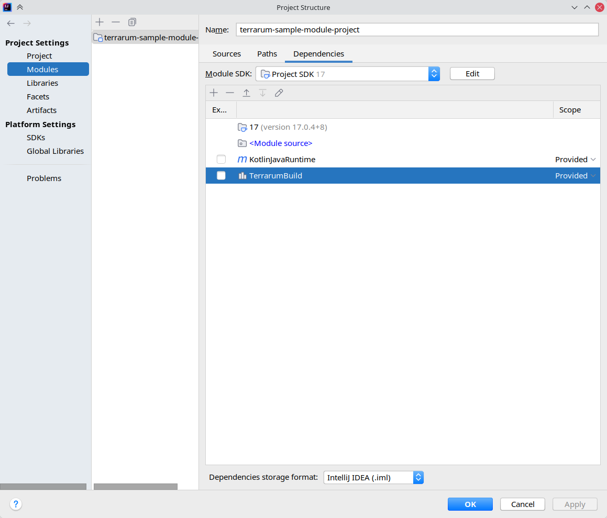

This is a sample project for Terrarum Modules.

## The Load Order

The new module must be "enabled" to be loaded.

Navigate to the user directory of the game, then add the directory name of the module into the `LoadOrder.txt`

## The Script Mod

Any module that has a .jar file is considered as a Script Mod, and they only run when the Script Mods are enabled in game.

To turn them on, launch the game, go to Options - Misc - Modules, then turn on Enable Script Mods

## Directory Structure

- `assets/mods/myawesomemod`
  - Anything related to `myawesomemod`, including finished product, goes here.
- `src`
  - Source code directory for the module.
- `lib`
  - External libraries. You DO need to copy-paste the `TerrarumBuild.jar` here.

## Building

IntelliJ Community Edition is required for the build.

After importing required external libraries, go to Project Structure - Project Settings - Modules - (project name) - Dependencies, and make sure the Scope of the `TerrarumBuild` is set to `Provided`, like the following image:

